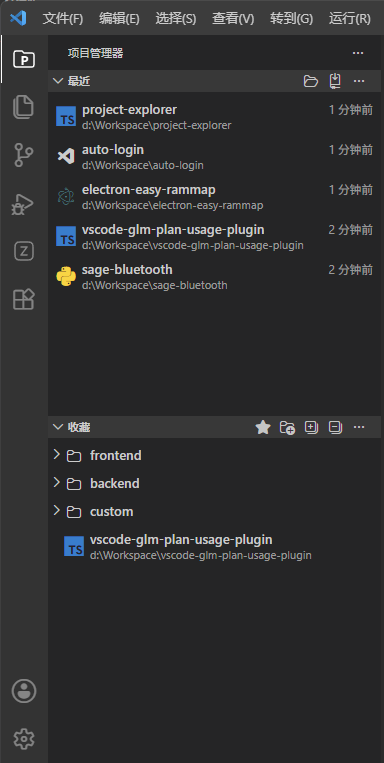

<h1 align="center">Project Explorer</h1>

自动记录，一键即达。

  
  

  <a href="https://github.com/sage-z-cn/project-explorer/blob/master/README.md">English</a> | <a href="https://github.com/sage-z-cn/project-explorer/blob/master/README.zh-cn.md">中文文档</a>

---

  

## 功能特性

✅ **自动记录** — 自动追踪每个打开过的项目，按时间排列，无需手动维护列表。

✅ **一键切换** — 在侧边栏直接点击打开任意项目，告别繁琐的文件夹浏览对话框。

✅ **收藏管理** — 将常用项目添加到收藏夹，支持一键收藏当前工作区，快速访问最重要的项目。

✅ **分组管理** — 在收藏夹中创建命名分组（按技术栈、团队、用途等），支持全部展开/折叠，项目再多也不乱。

✅ **Git 克隆** — 直接从侧边栏克隆 Git 仓库到本地，克隆完成即可打开。

✅ **项目类型识别** — 自动识别 16+ 种项目类型，包括 Java、Python、JavaScript、TypeScript、React、Vue、Electron、Go、Rust、C++、C#、PHP、Ruby、Swift、Kotlin、Dart，并显示对应的 devicon 图标，一目了然。

✅ **灵活的打开方式** — 支持单击、双击或跟随 IDE 设置打开项目，按你的习惯来。

✅ **窗口选择** — 可选择在新窗口或当前窗口打开项目，也可设置为每次询问。

✅ **清理无效项目** — 一键检测并清理文件夹已不存在的无效项目引用，保持列表整洁。

✅ **右键菜单** — 右键点击项目可执行打开、重命名、移除、收藏/取消收藏、在资源管理器中显示等操作。

✅ **项目重命名** — 自定义项目的显示名称，不影响实际文件夹名称。

✅ **快捷键** — 按 `Alt+O` 快速打开项目选择器，按 `Ctrl+Alt+O` 聚焦侧边栏。

✅ **国际化** — 支持中文和英文界面，随 VS Code 语言自动切换。

## 使用说明

安装扩展后，侧边栏会出现两个面板：

**最近** — 显示所有曾经打开过的项目，按最近访问时间排列。工具栏提供添加项目、克隆仓库、清理无效项目等操作。

**收藏** — 显示已收藏的项目和分组。工具栏提供收藏当前工作区、创建分组、展开/折叠所有分组等操作。

在任一面板中，点击项目即可打开。右键点击项目可查看更多操作。

## 配置

| 设置项 | 类型 | 默认值 | 说明 |
| --- | --- | --- | --- |
| `projectExplorer.recentProjectsLimit` | 数字 | `50` | 最近项目视图显示的最大项目数 |
| `projectExplorer.openProjectMode` | 枚举 | `ask` | 打开项目时使用新窗口还是当前窗口。可选值：`ask`（每次询问）、`currentWindow`（当前窗口）、`newWindow`（新窗口） |
| `projectExplorer.openMode` | 枚举 | `followIDE` | 点击项目时的行为。可选值：`singleClick`（单击打开）、`doubleClick`（双击打开）、`followIDE`（跟随 IDE 设置） |

## 快捷键

| 快捷键 | 功能 |
| --- | --- |
| `Alt+O` | 打开项目选择器 |
| `Ctrl+Alt+O` | 聚焦 Project Explorer 侧边栏 |

## 许可证

本项目基于 [GNU 通用公共许可证 v3.0](https://github.com/sage-z-cn/project-explorer/blob/master/LICENSE) 开源，可自由使用、修改和分发。衍生作品必须同样以 GPL 3.0 许可证发布。

